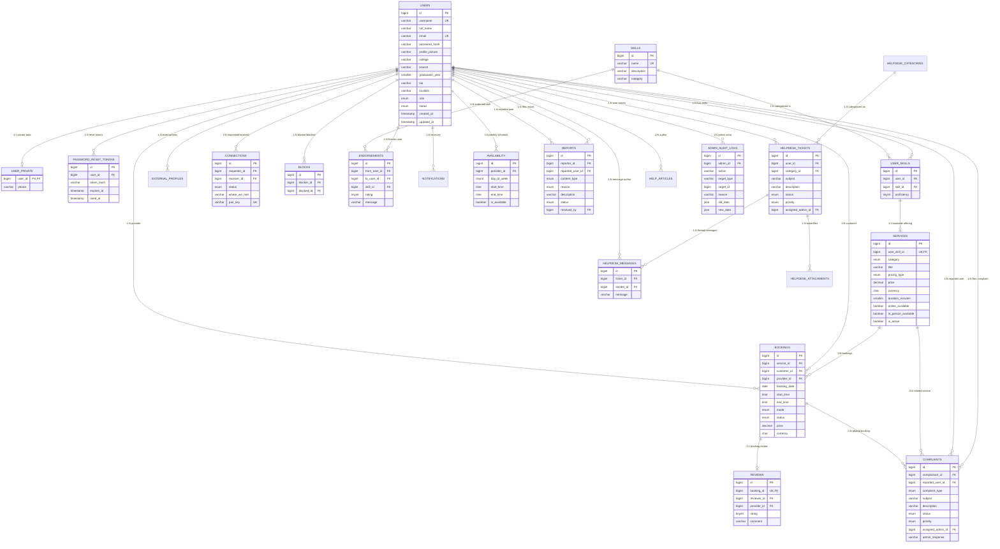

# SkillLink — Entity-Relationship (ER) Diagram

```mermaid
erDiagram
    USERS ||--o| USER_PRIVATE : "1:1 private data"
    USERS ||--o{ PASSWORD_RESET_TOKENS : "1:N reset tokens"
    USERS ||--o{ USER_SKILLS : "1:N has skills"
    SKILLS ||--o{ USER_SKILLS : "1:N categorized in"
    USERS ||--o{ EXTERNAL_PROFILES : "1:N external links"
    
    USERS ||--o{ CONNECTIONS : "1:N requested/received"
    USERS ||--o{ BLOCKS : "1:N blocker/blocked"
    USERS ||--o{ ENDORSEMENTS : "1:N from/to user"
    SKILLS ||--o{ ENDORSEMENTS : "1:N endorsed skill"
    USERS ||--o{ NOTIFICATIONS : "1:N receives"

    USER_SKILLS ||--o| SERVICES : "1:1 bookable offering"
    USERS ||--o{ AVAILABILITY : "1:N weekly schedule"
    SERVICES ||--o{ BOOKINGS : "1:N bookings"
    USERS ||--o{ BOOKINGS : "1:N customer"
    USERS ||--o{ BOOKINGS : "1:N provider"
    BOOKINGS ||--o| REVIEWS : "1:1 booking review"

    USERS ||--o{ COMPLAINTS : "1:N files complaint"
    USERS ||--o{ COMPLAINTS : "1:N reported user"
    SERVICES ||--o{ COMPLAINTS : "0:N related service"
    BOOKINGS ||--o{ COMPLAINTS : "0:N related booking"
    
    USERS ||--o{ REPORTS : "1:N files report"
    USERS ||--o{ REPORTS : "1:N reported user"

    HELPDESK_CATEGORIES ||--o{ HELPDESK_TICKETS : "1:N categorized as"
    USERS ||--o{ HELPDESK_TICKETS : "1:N user tickets"
    HELPDESK_TICKETS ||--o{ HELPDESK_MESSAGES : "1:N thread messages"
    USERS ||--o{ HELPDESK_MESSAGES : "1:N message author"
    HELPDESK_TICKETS ||--o{ HELPDESK_ATTACHMENTS : "1:N ticket files"

    USERS ||--o{ HELP_ARTICLES : "1:N author"
    USERS ||--o{ ADMIN_AUDIT_LOGS : "1:N admin actor"

    USERS {
        bigint id PK
        varchar username UK
        varchar full_name
        varchar email UK
        varchar password_hash
        varchar profile_picture
        varchar college
        varchar branch
        smallint graduation_year
        varchar bio
        varchar location
        enum role
        enum status
        timestamp created_at
        timestamp updated_at
    }

    USER_PRIVATE {
        bigint user_id PK, FK
        varchar phone
    }

    PASSWORD_RESET_TOKENS {
        bigint id PK
        bigint user_id FK
        varchar token_hash
        timestamp expires_at
        timestamp used_at
    }

    SKILLS {
        bigint id PK
        varchar name UK
        varchar description
        varchar category
    }

    USER_SKILLS {
        bigint id PK
        bigint user_id FK
        bigint skill_id FK
        tinyint proficiency
    }

    CONNECTIONS {
        bigint id PK
        bigint requester_id FK
        bigint receiver_id FK
        enum status
        varchar where_we_met
        varchar pair_key UK
    }

    BLOCKS {
        bigint id PK
        bigint blocker_id FK
        bigint blocked_id FK
    }

    ENDORSEMENTS {
        bigint id PK
        bigint from_user_id FK
        bigint to_user_id FK
        bigint skill_id FK
        tinyint rating
        varchar message
    }

    SERVICES {
        bigint id PK
        bigint user_skill_id UK, FK
        enum category
        varchar title
        enum pricing_type
        decimal price
        char currency
        smallint duration_minutes
        boolean online_available
        boolean in_person_available
        boolean is_active
    }

    AVAILABILITY {
        bigint id PK
        bigint provider_id FK
        tinyint day_of_week
        time start_time
        time end_time
        boolean is_available
    }

    BOOKINGS {
        bigint id PK
        bigint service_id FK
        bigint customer_id FK
        bigint provider_id FK
        date booking_date
        time start_time
        time end_time
        enum mode
        enum status
        decimal price
        char currency
    }

    REVIEWS {
        bigint id PK
        bigint booking_id UK, FK
        bigint reviewer_id FK
        bigint provider_id FK
        tinyint rating
        varchar comment
    }

    COMPLAINTS {
        bigint id PK
        bigint complainant_id FK
        bigint reported_user_id FK
        enum complaint_type
        varchar subject
        varchar description
        enum status
        enum priority
        bigint assigned_admin_id FK
        varchar admin_response
    }

    REPORTS {
        bigint id PK
        bigint reporter_id FK
        bigint reported_user_id FK
        enum content_type
        enum reason
        varchar description
        enum status
        bigint resolved_by FK
    }

    HELPDESK_TICKETS {
        bigint id PK
        bigint user_id FK
        bigint category_id FK
        varchar subject
        varchar description
        enum status
        enum priority
        bigint assigned_admin_id FK
    }

    HELPDESK_MESSAGES {
        bigint id PK
        bigint ticket_id FK
        bigint sender_id FK
        varchar message
    }

    ADMIN_AUDIT_LOGS {
        bigint id PK
        bigint admin_id FK
        varchar action
        varchar target_type
        bigint target_id
        varchar reason
        json old_data
        json new_data
    }
```
